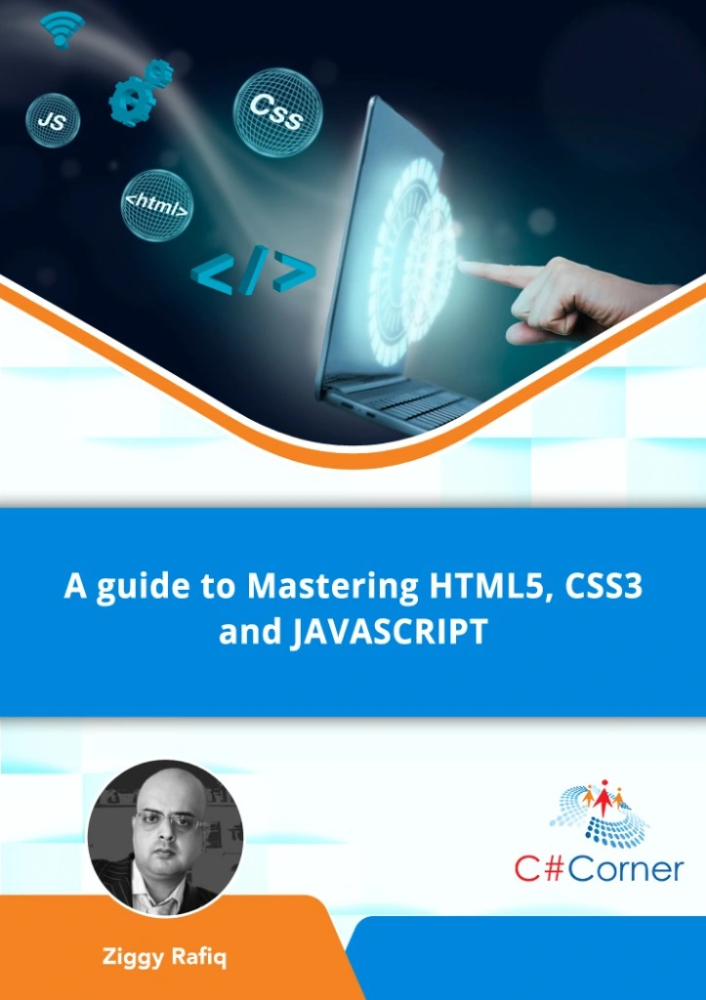

# A Guide To Mastering HTML5 CSS3 and Javascript

Welcome to "A Guide To Mastering HTML5 CSS3 and Javascript: Web Experiences Using Cutting-Edge Tools." This book is your comprehensive guide to mastering the essential web development technologies and tools required to create modern, interactive, and responsive web experiences.

## Table of Contents

1. [Chapter 1: Introduction to HTML5](#chapter-1-introduction-to-html5)
2. [Chapter 2: HTML5 Document Structure](#chapter-2-html5-document-structure)
3. [Chapter 3: HTML5 Elements](#chapter-3-html5-elements)
4. [Chapter 4: HTML5 Graphics and Animation](#chapter-4-html5-graphics-and-animation)
5. [Chapter 5: HTML5 APIs](#chapter-5-html5-apis)
6. [Chapter 6: HTML5 Multimedia](#chapter-6-html5-multimedia)
7. [Chapter 7: HTML5 Forms and Validation](#chapter-7-html5-forms-and-validation)
8. [Chapter 8: HTML5 Accessibility](#chapter-8-html5-accessibility)
9. [Chapter 9: CSS3 and Styling](#chapter-9-css3-and-styling)
10. [Chapter 10: HTML5 and JavaScript](#chapter-10-html5-and-javascript)
11. [Chapter 11: Building Modern Web Applications](#chapter-11-building-modern-web-applications)
12. [Chapter 12: Best Practices and Optimization](#chapter-12-best-practices-and-optimization)
13. [Chapter 13: Future Trends in HTML5](#chapter-13-future-trends-in-html5)
14. [Appendix: HTML5 Reference Guide](#appendix-html5-reference-guide)

## Chapter 1: Introduction to HTML5
- What is HTML5?
- The history of HTML
- Key features of HTML5

## Chapter 2: HTML5 Document Structure
- HTML Document Structure
- The `<!DOCTYPE>` declaration
- Head and body sections

## Chapter 3: HTML5 Elements
- Semantic elements (header, nav, section, article, etc.)
- Multimedia elements (audio, video, canvas)
- Form elements and improvements

## Chapter 4: HTML5 Graphics and Animation
- Scalable Vector Graphics (SVG)
- The `<canvas>` element
- CSS animations and transitions

## Chapter 5: HTML5 APIs
- Geolocation
- Web Storage (localStorage and sessionStorage)
- Drag and drop
- Web Workers

## Chapter 6: HTML5 Multimedia
- Embedding audio and video
- Media APIs
- Responsive images

## Chapter 7: HTML5 Forms and Validation
- New input types
- Form validation
- Custom form controls

## Chapter 8: HTML5 Accessibility
- Semantic markup for accessibility
- ARIA roles and attributes
- Testing for accessibility

## Chapter 9: CSS3 and Styling
- CSS3 features and enhancements
- Flexbox and Grid layout
- Media queries for responsive design

## Chapter 10: HTML5 and JavaScript
- Using JavaScript with HTML5
- DOM manipulation
- Asynchronous programming with Promises

## Chapter 11: Building Modern Web Applications
- Single Page Applications (SPA)
- Progressive Web Apps (PWA)
- Frameworks and libraries for HTML5 development

## Chapter 12: Best Practices and Optimization
- HTML5 performance tips
- SEO-friendly HTML5
- Cross-browser compatibility

## Chapter 13: Future Trends in HTML5
- Web components
- WebAssembly
- The evolution of HTML5

## Appendix: HTML5 Reference Guide
- HTML5 tags and attributes
- CSS3 properties
- JavaScript API references

Thank you for choosing "A Guide To Mastering HTML5 CSS3 and Javascript: Web Experiences Using Cutting-Edge Tools." As your guide to becoming a proficient web developer. We hope this book provides you with the knowledge and skills you need to excel in the ever-evolving world of web development.

## Author
### Ziggy Rafiq
- **Technical Lead Developer, C# Corner (MVP 🏅, VIP⭐️, Public Speaker🎤), Mentor, and Trainer**
- **C# Corner MVP, VIP, Speaker, Chapter Lead UK**
- Mentor and Trainer with solid experience in System Architecture for over 19 years
- Link to [**Ziggy Rafiq Blog**](https://blog.ziggyrafiq.com)
- Link to [**Ziggy Rafiq Website**](https://ziggyrafiq.com)
* [**Please remember to subscribe to My YouTube channel**](https://www.youtube.com/)
* [**Please remember to follow me on LinkedIn**](https://www.linkedin.com/in/ziggyrafiq/)
* [**Please remember to connect with me on C# Corner**](https://www.c-sharpcorner.com/members/ziggy-rafiq)
* [**Please remember to follow  me on Twitter/X**](https://twitter.com/ziggyrafiq)
* [**Please remember to follow  me on Instagram**](https://www.instagram.com/ziggyrafiq/)
* [**Please remember to follow  me on Facebook**](https://www.facebook.com/ziggyrafiq)

